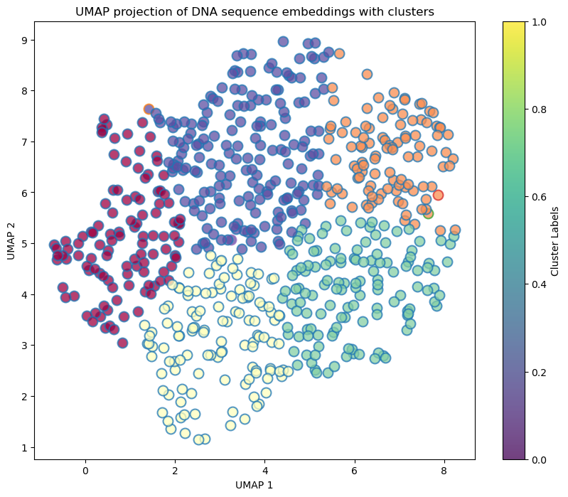

# Transformers on Genome Sequences



This repository demonstrates the use of transformers, including pre-trained BERT and DNABERT, to analyze and visualize genome sequences. The project downloads mitochondrial DNA sequences from various organisms, preprocesses them, and uses these transformer models to generate embeddings. These embeddings are then visualized using UMAP and clustered to observe the relationships between sequences from different organisms.

## Table of Contents

1. [Overview](#overview)
2. [Installation](#installation)
3. [Usage](#usage)
4. [Notebook Sections](#notebook-sections)
5. [Results](#results)
6. [Contributing](#contributing)
7. [License](#license)

## Overview

This project aims to provide insights into the heterogeneity and relationships between genome sequences from different organisms. By leveraging transformer models like pre-trained BERT and DNABERT, we can generate meaningful embeddings that capture the underlying structure of the sequences. The embeddings are visualized using UMAP and clustered to reveal patterns and relationships.

## Intuitive Description of Transformers Applied to DNA Sequences

Transformers have revolutionized the field of natural language processing (NLP) by enabling models to understand and generate human language with unprecedented accuracy. At their core, transformers are designed to capture the contextual relationships between words in a sentence, allowing them to understand meaning in a nuanced way. When applied to DNA sequences, transformers operate on a similar principle, but instead of words and sentences, they deal with the nucleotides (A, T, C, G) that make up genetic sequences.

### Analogies to Transformers Used for Text

1. **Vocabulary**:
   In text processing, transformers use a vocabulary of words. For DNA sequences, the "vocabulary" consists of the four nucleotides: adenine (A), thymine (T), cytosine (C), and guanine (G).

2. **Sentences and Sequences**:
   A sentence in NLP can be compared to a DNA sequence in genomics. Just as a sentence is a string of words, a DNA sequence is a string of nucleotides. Transformers process these sequences to understand their structure and function.

3. **Contextual Understanding**:
   Transformers for text understand the meaning of a word based on its context within a sentence. Similarly, transformers for DNA sequences capture the relationship between nucleotides within a genetic sequence, helping to reveal patterns and functions that are not apparent when looking at individual nucleotides in isolation.

4. **Embeddings**:
   In NLP, words are converted into embeddings—numeric representations that capture their meaning. For DNA, nucleotides or k-mers (short sequences of nucleotides) are converted into embeddings that capture their biological significance. These embeddings are used to analyze and compare sequences more effectively.

5. **Attention Mechanism**:
   The attention mechanism in transformers allows the model to focus on relevant parts of a sentence when making predictions. In the context of DNA, the attention mechanism helps the model to focus on important regions of the sequence that may be crucial for understanding genetic functions or identifying mutations.

By leveraging these similarities, transformers can be effectively applied to genomic data, providing powerful tools for biological research and advancing our understanding of genetics.

## Installation

To get started, clone the repository and install the required libraries:

```bash
git clone https://github.com/galenwilkerson/Transformers-on-Genome-Sequences.git
cd Transformers-on-Genome-Sequences
pip install -r requirements.txt
```

## Usage

1. **Download the DNA sequences**:
   The script automatically downloads mitochondrial DNA sequences for human, mouse, rat, and zebrafish from Ensembl.

2. **Run the Jupyter Notebook**:
   Open and run the Jupyter Notebook to process the DNA sequences, generate embeddings using pre-trained BERT and DNABERT, and visualize them using UMAP.

```bash
jupyter notebook "Transformers on Genome Sequences.ipynb"
```

## Notebook Sections

1. **Introduction**:
   Overview of the project and objectives.

2. **Setup**:
   Importing libraries, defining URLs for DNA sequences, and functions for downloading and decompressing datasets.

3. **Data Download**:
   Downloading mitochondrial DNA sequences from Ensembl for various organisms.

4. **BERT Embeddings**:
   Using pre-trained BERT to generate embeddings for the DNA sequences.

5. **DNABERT Embeddings**:
   Using DNABERT to generate embeddings for the DNA sequences.

6. **Dimensionality Reduction**:
   Applying UMAP to reduce the dimensionality of the embeddings for visualization.

7. **Clustering**:
   Performing clustering on the UMAP-reduced embeddings using Gaussian Mixture Models.

8. **Visualization**:
   Visualizing the UMAP projections with cluster labels and organism labels.

## Results

The UMAP visualization (above) shows clusters of DNA sequence embeddings, colored by the organism they belong to. The project highlights the relationships and differences between the sequences from different organisms.

## Contributing

Contributions are welcome! Please open an issue or submit a pull request for any improvements or bug fixes.

## License

This project is licensed under the MIT License - see the [LICENSE](LICENSE) file for details.
